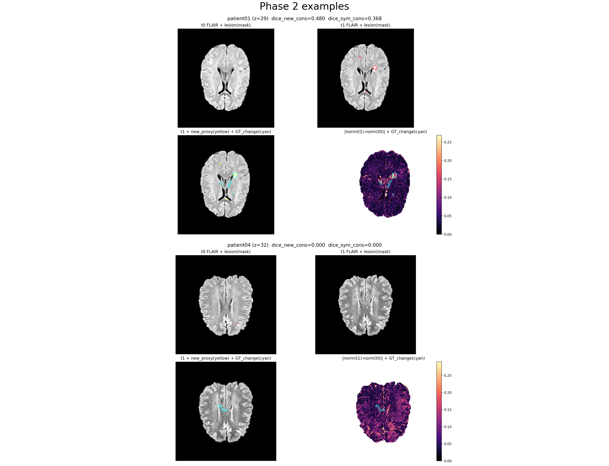
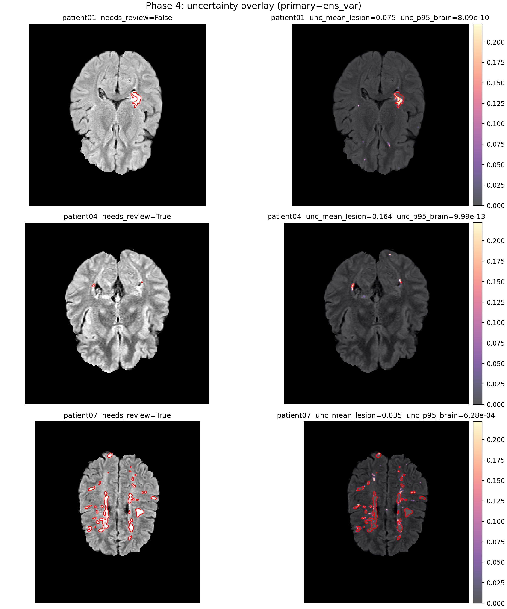
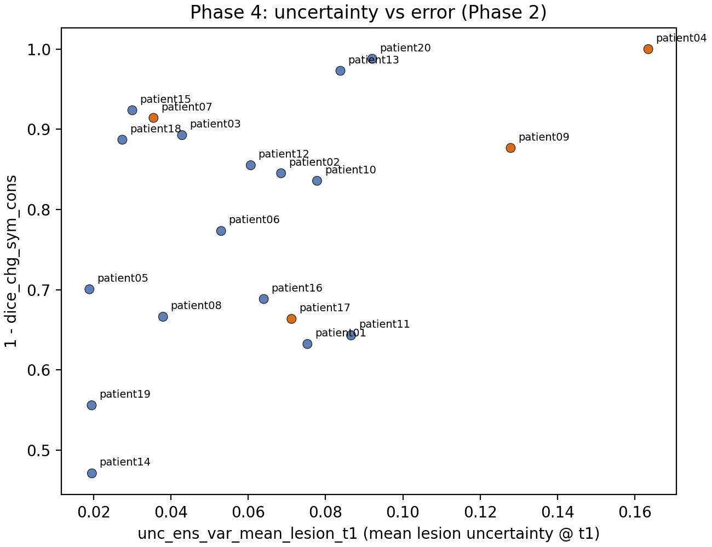

# MS-LAM — Longitudinal Brain MRI Monitoring Benchmark  

**MS-LAM** is a reproducible evaluation harness for **longitudinal brain MRI monitoring**.

Given paired baseline / follow-up scans, it produces **monitoring signals** (Δ lesion volume, conservative change proxies, segmentation-independent intensity-change evidence) and provides a **validation harness** for:

- agreement to an observed **change-region GT** (when available), and  
- **robustness sensitivity** under simulated scanner / protocol shifts (false-change risk).

Segmentation is treated as a **plug-in component**. The current baseline engine is **LST-AI** (pretrained; no bespoke training required).

> **Status (Jan 2026): actively developing.**  
> Core monitoring + validation + robustness are implemented on `open_ms_data` with LST-AI as the baseline engine.  
> See “Project status” and “Roadmap” below for what is implemented vs planned.

---

## What this repo is for (and what it is not)

### ✅ This repo is for
- Building a **longitudinal monitoring baseline** that is reproducible and auditable
- Stress-testing longitudinal metrics under **distributional shift** (scanner/protocol-like perturbations)
- Producing **patient-level reports** and **failure-mode evidence** (worst cases, drift curves)
- Serving as a scaffold for **uncertainty/QC**, **phenotyping**, and **external benchmarking**

### ❌ This repo is not
- A new SOTA segmentation architecture repo  
- A clinically approved system (research/education only)

MS-LAM currently supports a complete end-to-end pipeline on one public longitudinal MS dataset (`open_ms_data`). External benchmarks are planned and will be added incrementally.

---

## Key outputs (at a glance)

- Dataset inventory + sanity: `results/tables/phase0_manifest_checked.csv`
- Baseline lesion masks: `data/processed/lstai_outputs/patientXX/{t0,t1}/lesion_mask.nii.gz`
- Patient-level monitoring reports: `results/reports/phase2/patientXX.json`
- Aggregate monitoring table: `results/tables/phase2_longitudinal_metrics.csv`
- Robustness sensitivity summary: `results/tables/phase3_robustness_summary.csv`
- Robustness curves (mean±std): `results/figures/phase3_robustness_curve_deltaV.png`, `results/figures/phase3_robustness_curve_dice.png`
- Robustness curves (median/IQR): `results/figures/phase3_robustness_curve_deltaV_robust.png`, `results/figures/phase3_robustness_curve_dice_robust.png`
- Uncertainty/QC table: `results/tables/phase4_uncertainty_metrics.csv`
- Uncertainty/QC reports: `results/reports/phase4/patientXX.json`
- Uncertainty vs shift sensitivity: `results/figures/phase4_unc_vs_shift_sens_deltaV.png`

**Example montage (monitoring + GT validation + intensity-change evidence)**  


**Example QC evidence (uncertainty → patient flags)**  

| Uncertainty overlay (t1) | Uncertainty vs error |
|---|---|
|  |  |

How to read:
- Overlay: red contour = lesion mask; heatmap = primary uncertainty (default: ensemble variance). The figure includes your requested examples plus cohort maxima.
- Scatter: x = mean lesion uncertainty @ t1; y = `1 - dice_chg_sym_cons` (Phase 2). Orange points are QC-flagged (`needs_review=True`).

What this shows (in this cohort):
- Uncertainty hotspots often concentrate around predicted lesions/boundaries, which is a plausible region for disagreement-driven QC.
- QC flags tend to highlight cases with higher uncertainty and/or higher downstream error, while still allowing “high error but low lesion-uncertainty” cases (e.g., driven by brain-wide p95 rather than lesion mean).

Example cases (this run):
- `patient04`: flagged by high lesion-mean uncertainty at t1 (and also high Phase 2 error), a typical “needs review” case.
- `patient07`: flagged by high brain-wide p95 uncertainty at t1 even though lesion-mean uncertainty is not extreme (suggesting more global instability/artefacts).
- `patient01`: not flagged; shown as a non-flagged reference example.

**Robustness sensitivity (typical risk; median/IQR)**  


Caption: x = shift severity; y = `|ΔV_shift − ΔV_base|` (mm³), shown as median with IQR band across the selected cohort.
For full robustness outputs (including mean±std curves and worst-case visualization), see `docs/phase_notes/phase3.md`.

---

## Project status

| Module | Status | Notes |
|---|---:|---|
| Data inventory + sanity checks | ✅ | `open_ms_data` longitudinal/coregistered |
| Pretrained baseline inference (LST-AI) | ✅ | Docker runner + canonical outputs |
| Monitoring metrics + change-GT validation | ✅ | per-patient reports + cohort tables |
| Robustness sensitivity (shift_v1) | ✅ | `t1_only` / representative subset |
| Uncertainty maps + QC flags | ✅ | uncertainty summaries + cohort-quantile QC reports |
| Phenotyping / latent codes | 🔜 | feature table → embeddings/clustering |
| External benchmarks (ISBI 2015, SHIFTS 2022) | 🔜 | dataset adapters + rerun harness |
| Normative “digital twin”-style monitoring | 💤 | registration-based subtraction (later) |

---

## Data & pretrained baseline

### Dataset (implemented): `open_ms_data` (longitudinal/coregistered)
This repo starts from the public longitudinal MS dataset **open_ms_data**, specifically:

- 2 timepoints per patient (`study1`, `study2`)
- multi-contrast MRI (`T1W`, `T2W`, `FLAIR`)
- `brainmask.nii.gz`
- `gt.nii.gz` (change-region GT for longitudinal lesion changes)

Upstream repository (data not redistributed here):  
https://github.com/muschellij2/open_ms_data

> **License / attribution**: open_ms_data is released under CC-BY; please follow the upstream repository’s attribution instructions and cite the references listed there.

### Baseline segmentation engine (implemented): **LST-AI** (T1 + FLAIR)
We use **LST-AI** as a fixed pretrained MS lesion segmentation engine via Docker:

- CPU/GPU capable CLI
- exports lesion masks and probability maps (ensemble + sub-models)
- treated as a “segmentation plug-in” for downstream monitoring/validation

⚠️ **Research-only**: LST-AI is not approved for clinical decision-making.

Primary citation:
- Wiltgen T, McGinnis J, Schlaeger S, et al. *LST-AI: A Deep Learning Ensemble for Accurate MS Lesion Segmentation.*  
  **NeuroImage: Clinical** (2024) 42:103611. DOI: `10.1016/j.nicl.2024.103611`

Upstream repository:  
https://github.com/CompImg/LST-AI

---

## Installation

Prereqs:
- Python 3
- Docker Desktop (for LST-AI inference)

Install Python deps:
```bash
pip3 install -r requirements.txt
````

Pull LST-AI image:

```bash
docker pull jqmcginnis/lst-ai:v1.2.0
```

Apple Silicon note: runners use `--platform linux/amd64` for compatibility.
This can be slower and may require increased Docker memory. For faster runs, consider Linux/Colab for inference and copy outputs back.

---

## Quickstart (recommended workflow)

### 1) Get data (recommended: clone `open_ms_data`)

```bash
mkdir -p data/raw
git clone --depth 1 https://github.com/muschellij2/open_ms_data.git data/raw/open_ms_data
```

We use: `data/raw/open_ms_data/longitudinal/coregistered/`.

### 2) Build a manifest + run sanity checks

```bash
python3 scripts/01_make_manifest.py \
  --data-root data/raw/open_ms_data/longitudinal/coregistered \
  --out results/tables/phase0_manifest.csv

python3 scripts/02_phase0_sanity.py \
  --manifest results/tables/phase0_manifest.csv \
  --out-report results/tables/phase0_sanity_report.csv \
  --out-manifest results/tables/phase0_manifest_checked.csv
```

Optional: produce a few example figures:

```bash
python3 scripts/03_phase0_make_figures.py \
  --manifest results/tables/phase0_manifest_checked.csv \
  --out-dir results/figures \
  --num-patients 3
```

### 3) Run baseline inference (LST-AI)

Smoke test on 1–2 patients:

```bash
python3 scripts/04_run_lstai_batch.py --patients patient01,patient02 --timepoints both
```

Outputs per patient/timepoint:

* `data/processed/lstai_outputs/patientXX/t0/lesion_mask.nii.gz`
* `data/processed/lstai_outputs/patientXX/t0/lesion_prob.nii.gz`
* `data/processed/lstai_outputs/patientXX/t0/lesion_prob_model1.nii.gz` (and 2/3)

Example overlays:

```bash
python3 scripts/05_phase1_overlay_examples.py --patients patient01,patient02
```

Optional cohort scan (single PDF):

```bash
python3 scripts/06_phase1_qc_report.py
```

Notes:

* Do **not** pass `--stripped` for `open_ms_data` by default (brainmask exists, but images are not necessarily skull-stripped).
* LST-AI `--output` is a **directory**.
* With `--probability_map`, LST-AI writes probmaps under `--temp`; this repo copies them into canonical filenames.

### 4) Generate monitoring metrics + validate against change-GT

```bash
python3 scripts/07_eval_longitudinal.py
```

Key outputs:

* `results/tables/phase2_longitudinal_metrics.csv`
* `results/reports/phase2/patientXX.json`
* `results/figures/phase2_examples.png`
* `results/figures/phase2_worst_case.png`
* `results/figures/phase2_deltaV_hist.png`

Design highlights (v1):

* volumes in **mm³** (spacing-aware; never raw voxel counts)
* conservative new-lesion proxy (mm dilation + small-component filtering)
* symmetric change proxy (better aligned to change-region GT semantics)
* segmentation-independent intensity-change evidence (brainmask-normalized)

### 5) Robustness sensitivity under simulated shift (shift_v1)

Smoke test:

```bash
python3 scripts/08_run_robustness_suite.py --patients patient01,patient02 --mode t1_only --levels 0,1
```

Representative mini-batch (rule-based selection from Phase 2 table):

```bash
python3 scripts/09_select_phase3_patients.py
python3 scripts/08_run_robustness_suite.py \
  --patients $(paste -sd, results/tables/phase3_selected_patients.txt) \
  --mode t1_only \
  --levels 0,1,2
```

Outputs:

* `results/tables/phase3_robustness.csv` + `results/tables/phase3_robustness_summary.csv`
* `results/figures/phase3_robustness_curve_deltaV.png`
* `results/figures/phase3_robustness_curve_dice.png`
* `results/figures/phase3_robustness_curve_deltaV_robust.png`
* `results/figures/phase3_robustness_curve_dice_robust.png`
* `results/figures/phase3_sensitive_case.png`

Notes:
- For interpretation (median/IQR vs mean±std; and why the sensitive-case figure shows exactly one patient), see `docs/phase_notes/phase3.md`.

### 6) Uncertainty maps (voxel → patient) + QC flags

Compute voxel-level uncertainty proxies from saved probability maps, aggregate to patient-level summaries, derive
cohort-quantile thresholds, and write QC flags + reports:

```bash
python3 scripts/10_phase4_uncertainty_qc.py
```

Optional:
- save voxel maps (can be large): `python3 scripts/10_phase4_uncertainty_qc.py --save-maps`
- show more examples in the overlay: `--example-patients patient01,patient04,patient07`
- annotate more points in the scatter: `--scatter-annotate qc` (default) or `all`
- relate uncertainty to shift sensitivity (requires Phase 3 outputs): `python3 scripts/11_phase4_uncertainty_vs_shift_sensitivity.py`

Outputs:
- `results/tables/phase4_uncertainty_metrics.csv`
- `results/tables/phase4_qc_thresholds.json`
- `results/reports/phase4/patientXX.json`
- `results/figures/phase4_unc_overlay.png`
- `results/figures/phase4_unc_vs_error.png`
- `results/tables/phase4_uncertainty_vs_shift_sensitivity.csv` *(requires Phase 3 outputs)*
- `results/figures/phase4_unc_vs_shift_sens_deltaV.png` *(requires Phase 3 outputs)*
- `results/figures/phase4_unc_vs_shift_sens_dice.png` *(requires Phase 3 outputs)*

---

## Reproducibility & audit trail

* Patient reports embed voxel spacing/volume, proxy parameters, empty-mask policies, and normalization strategy.
* Runlogs record command args, return codes, runtime, and per-run metadata (e.g., `lstai_run.json`).
* Sanity checks use tolerant affine/spacing comparisons (`allclose`) to avoid false failures from tiny float diffs.

---

## Roadmap (planned modules)

### Phenotyping / latent codes

Goal: export patient-level features (ΔV, proxy dice/errors, robustness sensitivity, uncertainty summaries) and learn low-dim embeddings / clustering.

Planned artefacts:

* `results/tables/features_v1.csv`
* `results/tables/phenotype_assignments.csv`
* `results/figures/phase5_latent_space.png`

### External benchmarks (ISBI 2015, SHIFTS 2022)

Goal: add dataset adapters and re-run the same monitoring + validation harness.

* ISBI 2015 (Longitudinal MS Lesion Segmentation Challenge):
  Carass et al., 2017. DOI: `10.1016/j.neuroimage.2016.12.064`
  Data portal: [https://iacl.ece.jhu.edu/index.php/MSChallenge/data](https://iacl.ece.jhu.edu/index.php/MSChallenge/data)

* SHIFTS 2022 (MS lesion segmentation; robustness + uncertainty):
  Zenodo Part 1: DOI `10.5281/zenodo.7051658` (access/DUA constraints)
  Zenodo Part 2: DOI `10.5281/zenodo.7051692` (CC BY-NC-SA 4.0)
  Track page: [https://shifts.grand-challenge.org/medical-dataset/](https://shifts.grand-challenge.org/medical-dataset/)

### Normative / “digital-twin style” monitoring

Deferred heavy autoencoder training. Planned as a classical, interpretable extension:

* registration-based subtraction / anomaly maps
* (optional) deformation/Jacobian proxies for atrophy-like change

---

## Method notes (implementation details)

Detailed notes live under `docs/phase_notes/`.

---

## Non-clinical disclaimer

This repository is for **research and educational purposes only**. It is not a medical device and must not be used for clinical decision-making.

---

## How to cite / attribution

If you use this repo, please cite:

1. LST-AI (NeuroImage: Clinical 2024, DOI `10.1016/j.nicl.2024.103611`)
2. open_ms_data (and the original datasets it curates; see upstream repo for attribution)
3. (if used) ISBI 2015 challenge paper (Carass et al., 2017, DOI `10.1016/j.neuroimage.2016.12.064`)
4. (if used) SHIFTS Zenodo records (DOIs `10.5281/zenodo.7051658`, `10.5281/zenodo.7051692`)

Minimal BibTeX:

```bibtex
@article{Wiltgen2024LSTAI,
  title   = {LST-AI: A deep learning ensemble for accurate MS lesion segmentation},
  journal = {NeuroImage: Clinical},
  volume  = {42},
  pages   = {103611},
  year    = {2024},
  doi     = {10.1016/j.nicl.2024.103611}
}

@article{Carass2017LongitudinalMSChallenge,
  title   = {Longitudinal multiple sclerosis lesion segmentation: Resource and challenge},
  journal = {NeuroImage},
  volume  = {148},
  pages   = {77--102},
  year    = {2017},
  doi     = {10.1016/j.neuroimage.2016.12.064}
}

@dataset{ShiftsMSPart1Zenodo,
  title   = {Shifts Multiple Sclerosis Lesion Segmentation Dataset Part 1},
  year    = {2022},
  doi     = {10.5281/zenodo.7051658}
}

@dataset{ShiftsMSPart2Zenodo,
  title   = {Shifts Multiple Sclerosis Lesion Segmentation Dataset Part 2},
  year    = {2022},
  doi     = {10.5281/zenodo.7051692}
}
