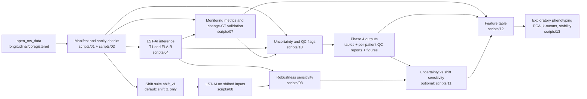

# MS-LAM — Longitudinal Brain MRI Monitoring Benchmark

**MS-LAM** asks a practical question: if you take a pretrained lesion segmentation model and run it on paired baseline / follow-up brain MRIs, how reliable are the resulting “change” signals — and what breaks them?

It is a reproducible pipeline that turns paired scans into longitudinal monitoring signals (volume change, conservative change proxies, segmentation-independent intensity evidence), then stress-tests those signals with robustness perturbations, uncertainty quantification, and validation against change-region ground truth.

The current baseline runs on the public `open_ms_data` longitudinal MS dataset (20 patients, 2 timepoints) using **LST-AI** as a fixed pretrained segmentation engine. Segmentation is a plug-in: the harness is designed so that engines can be swapped without changing the downstream evaluation.

> **Status (Mar 2026):** core pipeline implemented and run end-to-end on `open_ms_data` + LST-AI. External benchmarks planned.

---

## What we observed (on open\_ms\_data + LST-AI)

These are empirical observations from running the pipeline on this specific cohort and engine. They characterise the baseline, not general claims about LST-AI or MS monitoring.

**Pretrained segmentation ≠ change detection.**
The best-case Dice between a segmentation-derived change proxy and the change-region ground truth is 0.53 (patient14); the median across 20 patients is ~0.15. Volume change (ΔV) tracks the magnitude of ground-truth change reasonably well (Spearman ~0.79), but voxel-level overlap is poor. This gap comes from both GT semantics (change-region ≠ new-lesion) and cross-timepoint segmentation instability. The conservative symmetric proxy (`chg_sym_cons`) systematically overestimates GT change volume in 18 of 20 patients (median overshoot ~5,000 mm³), a structural bias of the XOR-plus-dilation approach that is independent of the segmentation model.

**Cross-timepoint intensity drift is the dominant confounder.**
FLAIR intensity ratios between timepoints range from 0.09 to 2.28 across patients — even though the data is coregistered and N4-corrected. This drift correlates with inflated volume-change signals (r ≈ 0.59). Simulated scanner/protocol shifts confirm the pattern: even mild perturbations to the follow-up scan inject ~1,000–1,600 mm³ of spurious ΔV (median), with worst-case extremes above 20,000 mm³. Gamma (brightness/contrast) shifts show a notably non-monotonic response, suggesting interaction with LST-AI's preprocessing thresholds.

**Ensemble uncertainty catches some failures but misses others.**
Cohort-quantile QC flags (4 of 20 patients flagged) correctly identify the worst segmentation failure (patient04, Dice = 0) and cases with brain-wide instability (patient07). The flags separate into two failure modes: focal lesion-boundary disagreement (patient04, patient09) and global prediction instability (patient07, patient17). However, several high-error patients pass QC, and on the Phase 3 subset, uncertainty does not predict shift sensitivity — the most shift-vulnerable patient (patient19) has low ensemble variance. Uncertainty is a useful but incomplete QC signal.

For detailed per-phase observations, see `docs/phase_notes/`.

---

## What this repo is for (and what it is not)

This repo is for building a **reproducible, auditable longitudinal monitoring baseline** — stress-testing it under distributional shift, quantifying uncertainty, and producing patient-level evidence of where it works and where it breaks. It is not a new segmentation architecture, and it is not a clinically approved system.

---

## Key outputs

**Monitoring + GT validation + intensity-change evidence (Phase 2)**


Each patient panel shows: t0/t1 FLAIR with lesion mask overlay, conservative new-lesion proxy (yellow) vs change-region GT (cyan), and brainmask-normalized intensity difference with GT overlay. Patient04 (bottom) illustrates a hard failure: the GT change region exists but the segmentation misses it entirely — while the intensity-difference map still shows signal there.

**Robustness sensitivity under simulated shift (Phase 3, median/IQR)**


Spurious |ΔV| introduced by shifting only the follow-up scan. Gamma shift produces the largest and most variable effect at level 1; noise and resolution shifts grow more monotonically. For mean±std curves and worst-case visualization, see `docs/phase_notes/phase3.md`.

**Uncertainty QC evidence (Phase 4)**

| Uncertainty overlay (t1) | Uncertainty vs error |
|---|---|
|  |  |

Left: red contour = lesion mask, heatmap = ensemble variance. Patient04 (high lesion-mean uncertainty) and patient07 (high brain-wide p95 uncertainty) are the two QC extremes; patient01 is a non-flagged reference. Right: x = mean lesion uncertainty @ t1, y = `1 − dice_chg_sym_cons`. Orange points are QC-flagged. Note that some high-error cases (e.g. patient20, patient13) are not flagged — uncertainty is a useful but incomplete error signal.

<details>
<summary><b>Full output file listing</b></summary>

- Dataset inventory + sanity: `results/tables/phase0_manifest_checked.csv`
- Baseline lesion masks: `data/processed/lstai_outputs/patientXX/{t0,t1}/lesion_mask.nii.gz`
- Patient-level monitoring reports: `results/reports/phase2/patientXX.json`
- Aggregate monitoring table: `results/tables/phase2_longitudinal_metrics.csv`
- Robustness sensitivity summary: `results/tables/phase3_robustness_summary.csv`
- Robustness curves: `results/figures/phase3_robustness_curve_deltaV.png` (mean±std), `results/figures/phase3_robustness_curve_deltaV_robust.png` (median/IQR), and corresponding Dice versions
- Uncertainty/QC table: `results/tables/phase4_uncertainty_metrics.csv`
- Uncertainty/QC reports: `results/reports/phase4/patientXX.json`
- Uncertainty vs shift sensitivity: `results/figures/phase4_unc_vs_shift_sens_deltaV.png`, `results/figures/phase4_unc_vs_shift_sens_dice.png`
- Feature table: `results/tables/features_v1.csv`
- Phenotyping: `results/tables/phenotype_assignments.csv`, `results/tables/phase5_cluster_profiles.csv`, `results/figures/phase5_latent_space_pca.png`, `results/figures/phase5_coassignment_heatmap.png`

</details>

---

## Project status

| Module | Status | Notes |
|---|---:|---|
| Data inventory + sanity checks | ✅ | `open_ms_data` longitudinal/coregistered |
| Pretrained baseline inference (LST-AI) | ✅ | Docker runner + canonical outputs |
| Monitoring metrics + change-GT validation | ✅ | per-patient reports + cohort tables |
| Robustness sensitivity (shift_v1) | ✅ | `t1_only` / representative subset |
| Uncertainty maps + QC flags | ✅ | uncertainty summaries + cohort-quantile QC reports |
| Phenotyping / latent codes | ✅ | feature table → PCA/k-means + stability |
| External benchmarks (ISBI 2015, SHIFTS 2022) | 🔜 | dataset adapters + rerun harness |
| Normative “digital twin”-style monitoring | 💤 | registration-based subtraction (later) |

---

## Project structure

### Repo layout

```text
ms-lam/
  data/
    raw/                       # local-only (not versioned)
      open_ms_data/            # upstream clone (recommended)
    processed/                 # local-only (not versioned)
      lstai_outputs/           # LST-AI outputs: patientXX/{t0,t1}/...
      lstai_outputs_shift_v1/  # LST-AI outputs under shift_v1 (optional)
      shift_v1/                # shifted inputs for robustness suite (optional)
      phase4_uncertainty_maps/ # voxel-level uncertainty maps (optional; can be large)
  results/
    tables/                    # small CSV/JSON outputs (often commit-friendly)
    figures/                   # key evidence figures (often commit-friendly)
    reports/                   # per-patient JSON reports
  src/mslam/                   # library code (IO, engines, metrics, preprocessing, viz)
  scripts/                     # runnable entrypoints (01..13)
  docs/phase_notes/            # method notes + run-dependent interpretation
```

### Pipeline overview (data → metrics → QC → robustness → features)

This diagram is a **high-level dependency view** (keeps the main dataflow readable; optional visualization-only steps are omitted).



## Data & pretrained baseline

### Dataset (implemented): `open_ms_data` (longitudinal/coregistered)
This repo starts from the public longitudinal MS dataset **open_ms_data**, specifically:

- 2 timepoints per patient (`study1`, `study2`)
- multi-contrast MRI (`T1W`, `T2W`, `FLAIR`)
- `brainmask.nii.gz`
- `gt.nii.gz` (change-region GT for longitudinal lesion changes)

Upstream repository (data not redistributed here):  
https://github.com/muschellij2/open_ms_data

> **License / attribution**: open_ms_data is released under CC-BY; please follow the upstream repository’s attribution instructions and cite the references listed there.

### Baseline segmentation engine (implemented): **LST-AI** (T1 + FLAIR)
We use **LST-AI** as a fixed pretrained MS lesion segmentation engine via Docker:

- CPU/GPU capable CLI
- exports lesion masks and probability maps (ensemble + sub-models)
- treated as a “segmentation plug-in” for downstream monitoring/validation

⚠️ **Research-only**: LST-AI is not approved for clinical decision-making.

Primary citation:
- Wiltgen T, McGinnis J, Schlaeger S, et al. *LST-AI: A Deep Learning Ensemble for Accurate MS Lesion Segmentation.*  
  **NeuroImage: Clinical** (2024) 42:103611. DOI: `10.1016/j.nicl.2024.103611`

Upstream repository:  
https://github.com/CompImg/LST-AI

---

## Installation

Prereqs:
- Python 3
- Docker Desktop (for LST-AI inference)

Install Python deps:
```bash
pip3 install -r requirements.txt
```

Optional (dev): install pre-commit hooks (runs a minimal `ruff` lint on `git commit`):

```bash
pip3 install -r requirements-dev.txt
pre-commit install
```

Pull LST-AI image:

```bash
docker pull jqmcginnis/lst-ai:v1.2.0
```

Apple Silicon note: runners use `--platform linux/amd64` for compatibility.
This can be slower and may require increased Docker memory. For faster runs, consider Linux/Colab for inference and copy outputs back.

---

## Quickstart

**Smoke test (no data, no Docker):**

```bash
python3 scripts/00_toy_smoke_test.py --overwrite
```

This generates a tiny synthetic cohort and runs the core pipeline (monitoring → uncertainty/QC → phenotyping) end-to-end. Outputs go to `results/_toy/`. It is for pipeline validation only (no clinical meaning).

**Full pipeline on `open_ms_data`:** see [`docs/quickstart.md`](docs/quickstart.md) for the step-by-step walkthrough (data download → LST-AI inference → monitoring metrics → robustness → uncertainty QC → phenotyping).

---

## Reproducibility & audit trail

* Patient reports embed voxel spacing/volume, proxy parameters, empty-mask policies, and normalization strategy.
* Runlogs record command args, return codes, runtime, and per-run metadata (e.g., `lstai_run.json`).
* Sanity checks use tolerant affine/spacing comparisons (`allclose`) to avoid false failures from tiny float diffs.

---

## Roadmap

### Near-term

- **Phase 5 enhancement**: run Phase 3 robustness on the full cohort (currently 8/20 patients) so that Phase 5 can switch to `--feature-set mode_b` and include shift-sensitivity features.
- **External benchmarks** (ISBI 2015, SHIFTS 2022): add dataset adapters and re-run the same monitoring + validation harness.
  - ISBI 2015: Carass et al., 2017. DOI: `10.1016/j.neuroimage.2016.12.064`. [Data portal](https://iacl.ece.jhu.edu/index.php/MSChallenge/data)
  - SHIFTS 2022: DOI `10.5281/zenodo.7051658` / `10.5281/zenodo.7051692`. [Track page](https://shifts.grand-challenge.org/medical-dataset/)

### Later

- **Normative / “digital-twin style” monitoring**: registration-based subtraction / anomaly maps; deformation/Jacobian proxies for atrophy-like change. (Deferred; no autoencoder training planned in the short term.)

---

## Method notes

Detailed method definitions and per-phase observations live under `docs/phase_notes/` (one file per phase). Each note covers inputs, method design, outputs, and what the current run on `open_ms_data` showed.

---

## Non-clinical disclaimer

This repository is for **research and educational purposes only**. It is not a medical device and must not be used for clinical decision-making.

---

## How to cite / attribution

If you use this repo, please cite:

1. LST-AI (NeuroImage: Clinical 2024, DOI `10.1016/j.nicl.2024.103611`)
2. open_ms_data (and the original datasets it curates; see upstream repo for attribution)
3. (if used) ISBI 2015 challenge paper (Carass et al., 2017, DOI `10.1016/j.neuroimage.2016.12.064`)
4. (if used) SHIFTS Zenodo records (DOIs `10.5281/zenodo.7051658`, `10.5281/zenodo.7051692`)

Minimal BibTeX:

```bibtex
@article{Wiltgen2024LSTAI,
  title   = {LST-AI: A deep learning ensemble for accurate MS lesion segmentation},
  journal = {NeuroImage: Clinical},
  volume  = {42},
  pages   = {103611},
  year    = {2024},
  doi     = {10.1016/j.nicl.2024.103611}
}

@article{Carass2017LongitudinalMSChallenge,
  title   = {Longitudinal multiple sclerosis lesion segmentation: Resource and challenge},
  journal = {NeuroImage},
  volume  = {148},
  pages   = {77--102},
  year    = {2017},
  doi     = {10.1016/j.neuroimage.2016.12.064}
}

@dataset{ShiftsMSPart1Zenodo,
  title   = {Shifts Multiple Sclerosis Lesion Segmentation Dataset Part 1},
  year    = {2022},
  doi     = {10.5281/zenodo.7051658}
}

@dataset{ShiftsMSPart2Zenodo,
  title   = {Shifts Multiple Sclerosis Lesion Segmentation Dataset Part 2},
  year    = {2022},
  doi     = {10.5281/zenodo.7051692}
}
```

---

## License

Code is released under the MIT License (see `LICENSE`).  
Data and model weights are governed by their respective upstream licenses/terms (see “Data & pretrained baseline”).
