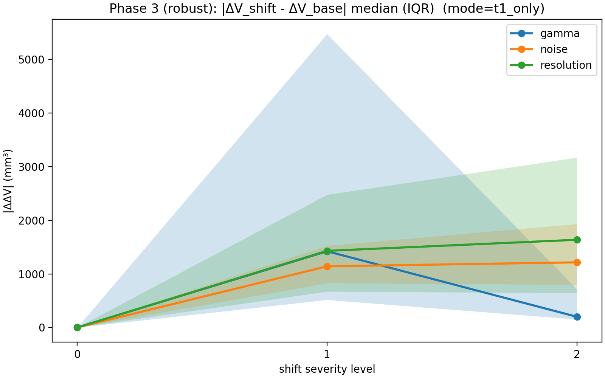
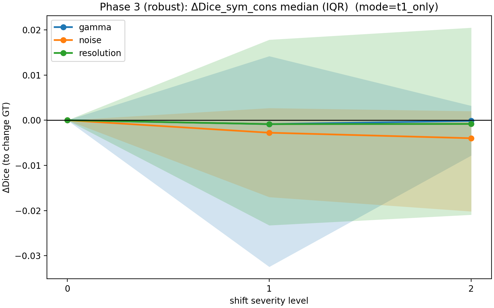
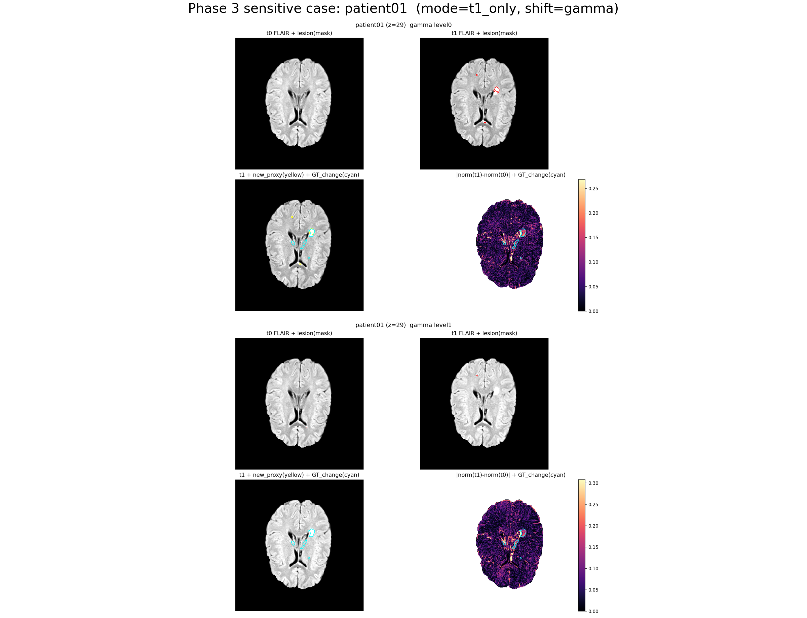

# Phase 3: Robustness sensitivity under scanner/protocol shift (shift_v1)

This phase stress-tests the **monitoring + validation harness** (Phases 1–2) under controlled input perturbations
that mimic scanner/protocol heterogeneity.

LST-AI is treated as a fixed pretrained engine; the goal is to measure how longitudinal metrics change under shift.

## Experimental design (v1)

### Who gets shifted?
Default mode is **`t1_only`**: only the follow-up (t1) inputs are shifted, while t0 is kept unchanged.
This matches the practical monitoring scenario where scanner/protocol differs at follow-up and may create *spurious change*.

A control mode **`both`** is also supported (shift t0 and t1 with the same parameters). In a healthy pipeline,
same-source shifts should generally perturb longitudinal **Δ** metrics less than shifting only one timepoint.

## Suggested patient subset (representative mini-batch)
When iterating locally (or when compute is limited), it is reasonable to run Phase 3 on a representative subset
instead of the full cohort. A simple, reproducible selection rule is:
- Take patients with **largest** and **smallest** `change_gt_vol_mm3` (large-change vs near-zero regime),
- Take patients with **highest** and **lowest** baseline `dice_chg_sym_cons` (best-case vs worst-case regime),
- De-duplicate with the priority: worst-dice → highest-GT → lowest-GT → best-dice, and fill with median-ish cases if needed.

This rule is implemented in `scripts/09_select_phase3_patients.py`.

## Design rationale

**Why these four shift types?**
Gamma, noise, resolution, and blur represent the four most common sources of image-level variability in longitudinal MRI: scanner recalibration / protocol changes (gamma/brightness), thermal and electronic noise (Gaussian noise), acquisition matrix and reconstruction differences (resolution), and point-spread-function variation (blur). They are also the perturbations most commonly used in domain-shift robustness literature for medical imaging. Geometric distortions are deliberately excluded (B0 inhomogeneity, gradient nonlinearity) because the `open_ms_data` inputs are already coregistered — spatial shifts would conflate robustness testing with registration quality testing.

**Why these specific severity levels?**
The levels are chosen to span a "mild to moderate" range that is plausible in real multi-site longitudinal studies, not to simulate catastrophic degradation:
- Gamma 0.8/1.2 with ±0.02 brightness offset: roughly the range of intensity nonlinearity between scanner vendors or after a software update.
- Noise σ\_rel 0.01/0.03 of the (p99−p1) intensity range: 1% is barely perceptible; 3% is noticeable but not clinically unusual for older scanners.
- Resolution 1.5×/2.0× in-plane downsample-then-upsample: simulates going from a high-resolution 3D acquisition to a coarser 2D protocol (common in longitudinal studies where the scanner or protocol changed between visits).
- Blur 0.5/1.0 mm σ (optional, not enabled by default): a mild smoothing that can accompany motion or reconstruction differences.

These are not calibrated to any specific scanner pair; they are order-of-magnitude plausible perturbations.

## shift_v1 suite (deterministic, levelled)

Each shift is defined as `shift_name × severity_level`:
- `level0`: identity (baseline)
- `level1/2`: increasing perturbation strength

Shifts implemented (v1):
- `gamma`: intensity gamma change with a small brightness offset in normalized space (levels: 1.0 / 0.8(+0.02) / 1.2(−0.02))
- `noise`: Gaussian noise with sigma relative to brainmask intensity range (levels: 0 / 0.01 / 0.03 of `(p99-p1)`)
- `resolution`: downsample→upsample back to original grid (in-plane XY) (levels: factor 1.0 / 1.5 / 2.0)
- `blur`: Gaussian blur in mm (levels: 0 / 0.5 / 1.0 mm) *(optional; not enabled by default)*

### Synchronization rules
- All geometric/resolution-related shifts are applied **synchronously** to T1 and FLAIR (same parameters).
- All outputs are written back on the **original reference grid** (same shape/affine), so `brainmask`/`gt_change` can be reused.
- After intensity-affecting shifts, values are clipped back to a brainmask-based percentile range (p1–p99) to avoid invalid inputs.

## Outputs

The Phase 3 runner produces:
- `results/tables/phase3_robustness.csv`: per-patient, per-shift, per-level metrics + sensitivity vs baseline
- `results/tables/phase3_robustness_summary.csv`: aggregated mean/std per shift/level
- `results/tables/phase3_runlog.csv`: LST-AI docker run log for shifted inference
- `results/figures/phase3_robustness_curve_deltaV.png`: sensitivity curve for |ΔV_shift − ΔV_base|
- `results/figures/phase3_robustness_curve_dice.png`: sensitivity curve for Dice_sym_cons shift-induced change
- `results/figures/phase3_robustness_curve_deltaV_robust.png`: median (IQR) sensitivity curve for |ΔV_shift − ΔV_base|
- `results/figures/phase3_robustness_curve_dice_robust.png`: median (IQR) sensitivity curve for Dice_sym_cons shift-induced change
- `results/figures/phase3_sensitive_case.png`: a worst-case example across severity levels

## Key interpretation (what this phase means)
- Large |ΔΔV| under `t1_only` indicates that follow-up heterogeneity can create **false change** in monitoring signals.
- Dice drops (vs change-GT) under shift indicate degraded agreement with observed change regions, helping diagnose “unsafe” conditions.

### Mean±std vs median(IQR)
Both are saved:
- **mean±std** curves: emphasize *tail risk* (but can be dominated by outliers on small cohorts),
- **median(IQR)** curves: emphasize *typical* sensitivity and are more robust to a single extreme case.

## Figures (recommended reading order)

### Typical sensitivity (robust)
These summarize the *typical* impact of shift on monitoring/validation signals (median with IQR band):

- y-axis is `|ΔV_shift − ΔV_base|` (mm³). If this grows with severity, follow-up heterogeneity can create *false change*.

- y-axis is `Dice_sym_cons(shift) − Dice_sym_cons(base)` (to change-GT). Negative values indicate degraded agreement under shift.

### Tail risk / failure mode (single worst-case)
This figure intentionally shows **one** patient: the worst case selected by largest `|ΔΔV|` among shifted runs.
It is meant for diagnosing *how* shift breaks the pipeline, not for representing a typical patient.

## Observations on open\_ms\_data (8-patient subset)

### Typical sensitivity

Under `t1_only` shifts, the median spurious |ΔV| at level 1 is roughly 1,100–1,400 mm³ across shift types, growing modestly at level 2 for noise and resolution. To put this in context: the cohort's median GT change volume is ~4,200 mm³, so a typical shift can inject false change equivalent to 25–35% of a typical real change.

### Gamma shift is non-monotonic

Gamma (brightness/contrast) shift produces the largest and most variable effect at level 1, but level 2 partially recovers for some patients. For example, patient19 has |ΔΔV| ≈ 20,800 mm³ at gamma level 1 but only ~6,400 mm³ at level 2. This non-monotonic pattern suggests that LST-AI's preprocessing (intensity clipping, standardization) has threshold effects that interact non-linearly with input brightness changes. It also explains why the IQR band for gamma is so wide on the robust curve.

### Tail risk is dominated by a single patient

Patient19 is the extreme outlier across all shift types and levels. Its gamma level 1 |ΔΔV| (~20,800 mm³, Dice drop ~−0.27) accounts for most of the gap between the mean±std and median/IQR curves. This validates the design choice of reporting both summary statistics: mean±std emphasizes tail risk, while median/IQR reflects the typical case.

### Relative risk is higher for small-change patients

For patients with small GT change (e.g. patient20: GT ~416 mm³, patient13: GT ~489 mm³), even the modest shift-induced |ΔΔV| of ~1,000–1,500 mm³ represents a ratio of 2–3× the real change — meaning the monitoring signal is completely swamped by shift-induced noise. This is a core practical risk for longitudinal monitoring: the patients where you most need to detect subtle change are also the most vulnerable to false signals.

### Subset coverage caveat

The 8-patient subset was selected for Phase 2 representativeness (extremes of GT size and baseline Dice), not for QC risk. Only 1 of the 4 QC-flagged patients (patient04) is included. To fully characterize how high-uncertainty cases respond to shift, Phase 3 should be extended to the full cohort.
