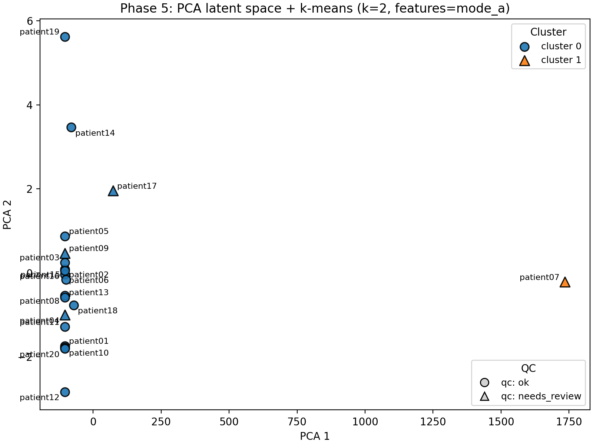
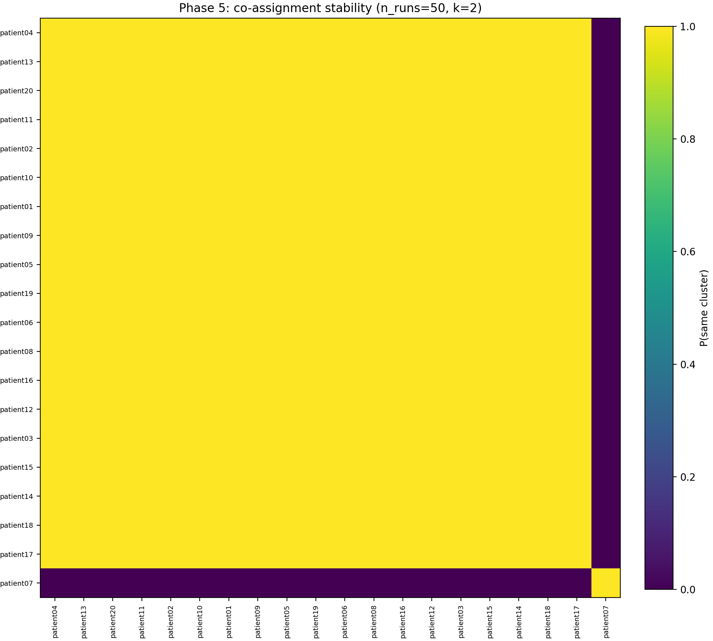

# Phase 5: Exploratory phenotyping / latent codes (feature space organisation)

Phase 5 turns the monitoring + validation outputs (Phases 2–4, optionally Phase 3) into a **patient-level feature table**
and a simple, reproducible **latent representation**.

This module is intentionally **exploratory**:
- it is designed for **hypothesis generation** and pipeline extension,
- not for claiming clinically meaningful “subtypes” (small N and model-derived features can reflect QC/algorithmic variance).

## Inputs
- Phase 2 metrics: `results/tables/phase2_longitudinal_metrics.csv`
- Phase 4 uncertainty/QC: `results/tables/phase4_uncertainty_metrics.csv`
- Optional robustness sensitivity (subset or full cohort):
  - `results/tables/phase4_uncertainty_vs_shift_sensitivity.csv` (produced by `scripts/11_phase4_uncertainty_vs_shift_sensitivity.py`)

## Feature table (one row per patient)

The export is a single table that mixes:
- **monitoring features** (model-based + segmentation-independent evidence),
- **uncertainty/QC features**,
- and (explicitly labeled) **evaluation features** that depend on the change-GT (dataset-specific).

Heavy-tailed, non-negative quantities (e.g., volumes) also get `log1p_...` columns for stable downstream analysis.

Run:
- `python3 scripts/12_phase5_export_features.py`

Output:
- `results/tables/features_v1.csv`

## Design rationale

**Why PCA + k-means?**
Phase 5 is explicitly exploratory (N=20). The goal is not to discover optimal cluster structure, but to check whether the feature space assembled from Phases 2–4 organises patients in an interpretable way. PCA + k-means is chosen for transparency and reproducibility: PCA axes are deterministic and linearly interpretable (you can read off which features drive each component), and k-means is the simplest partitional clustering algorithm with well-understood behaviour. More complex methods (UMAP, DBSCAN, Gaussian mixtures) would add hyperparameters and nonlinearity that are hard to justify on 20 data points.

**Why robust scaling?**
Several features (e.g. lesion volume, volume error) span orders of magnitude and contain outliers (patient07's 58,000 mm³ volume error, patient19's 22,000 mm³ ΔV). Standard z-scoring would let these outliers dominate the variance. Robust scaling (using median and IQR instead of mean and standard deviation) reduces outlier influence on the feature space, so that clustering reflects the overall patient distribution rather than just the extremes.

**Why silhouette score for k selection?**
Silhouette is a simple, internal-validity metric that balances cluster cohesion and separation without requiring a generative model. On a 20-patient dataset, more sophisticated methods (Gap statistic, BIC-based selection) tend to be unstable. Silhouette's main limitation — it favours convex, similarly-sized clusters — is acceptable here because the analysis is not looking for complex cluster shapes.

**Why 50 random seeds for stability?**
K-means results depend on initialisation. Running 50 seeds and computing a co-assignment matrix (how often each pair of patients lands in the same cluster) is a lightweight way to check whether the partition is an artefact of a lucky initialisation or a genuine structure. 50 seeds is enough to estimate co-assignment probabilities with ~±0.07 precision (binomial standard error), which is sufficient to distinguish "always together" from "sometimes together" at this sample size. More seeds would marginally improve precision but add runtime.

## Latent space + clustering (minimal, reproducible)

Default pipeline:
1) robust scaling
2) PCA (2D for visualization; up to 5D for clustering)
3) k-means (k chosen by silhouette over a small k-range, unless fixed)
4) **stability** via repeated seeds (co-assignment matrix)

Run (recommended default for “phenotyping-style” exploration):
- `python3 scripts/13_phase5_phenotyping.py --feature-set mode_a_pheno`

Outputs:
- `results/tables/phenotype_assignments.csv`
- `results/tables/phase5_cluster_profiles.csv`
- `results/tables/phase5_k_selection.csv`
- `results/figures/phase5_latent_space_pca.png`
- `results/figures/phase5_coassignment_heatmap.png`

### Avoiding “QC-outlier-only” clustering
Depending on your cohort, including global tail-uncertainty (e.g., `unc_ens_var_p95_brain_t1`) can cause
the latent space + k-means to primarily separate a single QC outlier (useful, but not always “phenotyping”).

Two options:
- Use the phenotyping-oriented feature set (excludes `unc_ens_var_p95_brain_t1`):  
  `python3 scripts/13_phase5_phenotyping.py --feature-set mode_a_pheno`
- Or use the QC-oriented feature set (includes `unc_ens_var_p95_brain_t1`):  
  `python3 scripts/13_phase5_phenotyping.py --feature-set mode_a`
- Or keep the original features but avoid singleton clusters during automatic k selection:  
  `python3 scripts/13_phase5_phenotyping.py --min-cluster-size 2`

### Mode B (optional; includes robustness sensitivity)
If you have Phase 3 sensitivity columns in `features_v1.csv` (e.g. after running Phase 3 on more patients),
you can switch to:
- `python3 scripts/13_phase5_phenotyping.py --feature-set mode_b --missing drop`

## Figures (example; Mode A_pheno)
These figures are meant as **exploratory evidence** of how patients distribute in the feature space and how stable the
groupings are under different random seeds.

Recommended default visualization uses:
- color = k-means cluster (exploratory grouping),
- marker shape = QC flag (`qc_needs_review` from Phase 4).

Generated by:
- `python3 scripts/13_phase5_phenotyping.py --feature-set mode_a_pheno --qc-encoding marker`

## Interpretation guidelines
- Treat clusters as **groupings in a quality-aware feature space**, not clinical phenotypes.
- Use `phase5_cluster_profiles.csv` to see what drives each cluster (e.g., change magnitude vs uncertainty vs intensity-change).
- Use `phase5_coassignment_heatmap.png` to judge whether groupings are stable under different random seeds.

## Observations on open\_ms\_data

### Mode A (includes `unc_ens_var_p95_brain_t1`): QC-outlier isolation

With the full feature set including brain-wide tail uncertainty, k-means selects k=2 with silhouette ~0.94 — but the result is a singleton cluster: patient07 alone in cluster 1, everyone else in cluster 0. This is not a bug; it is an accurate reflection of the feature space: patient07's brain-wide p95 uncertainty is an order of magnitude higher than the rest of the cohort, so it dominates the first principal component. This mode is useful as an automatic outlier detector but does not reveal structure among the remaining 19 patients.

### Mode A\_pheno (excludes `unc_ens_var_p95_brain_t1`): change-magnitude grouping

With the phenotyping-oriented feature set, k-means again selects k=2 (silhouette lower but still reasonable). Cluster 1 now contains patient14, patient17, and patient19 — the three patients with the largest |ΔV| and new-lesion volume. Their cluster profile shows median ΔV ~14,400 mm³ and median `log1p_new_cons_vol` ~9.5, compared to ~−34 mm³ and ~7.3 for cluster 0.

The co-assignment heatmap shows perfect stability (all pairs at 1.0) across 50 random seeds, meaning the 2-cluster partition is robust. However, with N=20, this is likely reflecting "big change vs everything else" rather than fine-grained phenotypic structure. The dominant axis in the PCA space is change magnitude; secondary axes (intensity drift, uncertainty) contribute but do not create additional separable groups at this sample size.

### What this means for the benchmark

Phase 5 confirms that the feature space assembled from Phases 2–4 is internally coherent: patients with extreme monitoring signals (large ΔV, large new-lesion proxy) cluster together, and the QC outlier (patient07) is correctly separated when brain-wide uncertainty is included. The current feature set reliably captures "change scale" as the primary axis of variation. Finer-grained structure — distinguishing, say, "high drift but small real change" from "low drift but large real change" — would require either a larger cohort or more discriminative features (e.g., spatial change distribution, registration-derived signals).
